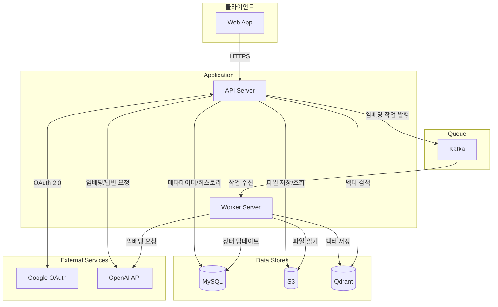
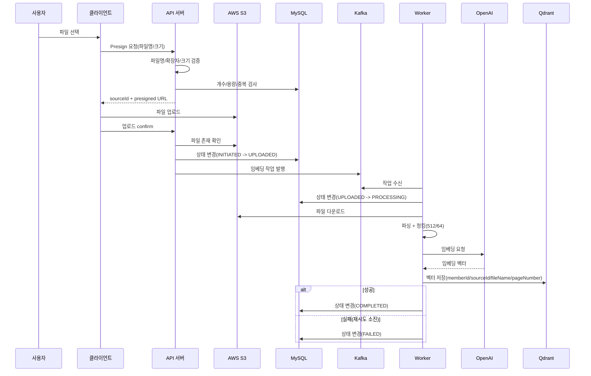
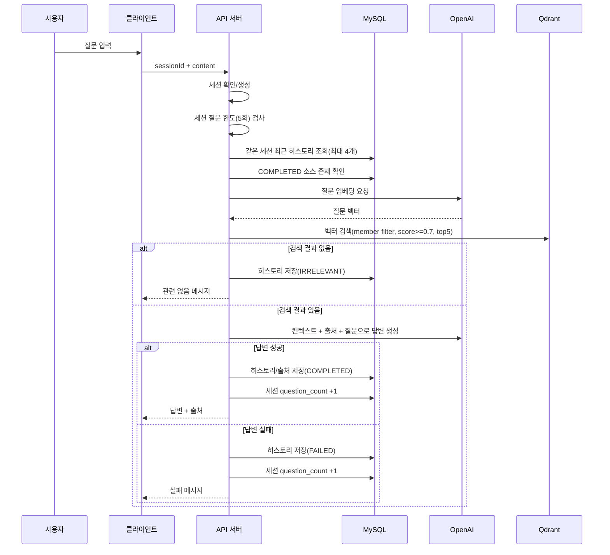

# 프로젝트 (현재 운영 기준)

기준일: 2026-02-19  
기준 코드: 현재 `main`/HEAD

## 1. 서비스 개요

내가 올린 문서 기반으로 AI가 답을 찾아주고, 출처까지 알려주는 개인 문서 검색 서비스

**핵심 기능:**
1. 문서 업로드 및 관리 (PDF, TXT, MD)
2. 내 문서 기반 질문 → 답변 + 출처 제공
3. 멀티턴 대화 (세션 단위 컨텍스트 반영)
4. 질문/답변 히스토리 관리

**사용자 흐름:** Google 로그인 → 파일 업로드 → 처리 상태 확인 → 질문 → 답변 + 출처 확인 → 히스토리 조회

---

## 2. 현재 기능/정책

### 2.1 회원

| 항목 | 현재 동작 |
|------|------|
| 인증 | Google OAuth 2.0 + JWT 쿠키 |
| 탈퇴 | soft delete + access/refresh 쿠키 즉시 삭제 |
| 복구 | 재로그인 시 자동 복구 (`deleted_at` 해제) |
| 탈퇴 시 데이터 | 사용자/파일/벡터/히스토리 데이터 유지 |

### 2.2 파일 업로드

| 항목 | 현재 동작 |
|------|------|
| 지원 형식 | `.pdf`, `.txt`, `.md` |
| 파일당 최대 | 30MB |
| 사용자당 총 용량 | 300MB |
| 사용자당 파일 개수 | 최대 30개 |
| 중복 파일명 | 거부 (`INITIATED` 제외 상태 기준) |

**업로드 동작:**
- Presigned URL 발급 → 클라이언트 S3 직접 업로드 → `confirm` 호출로 업로드 확정
- 업로드 모달에서 진행률 표시
- 업로드 완료 시 모달 닫힘, 임베딩은 백그라운드 진행

**파일명 규칙:** 최대 30자, 한글/영문/숫자/`_`/`-`만 허용

**수정 정책:** 수정 불가, 삭제 후 재업로드

### 2.3 파일 관리

**목록 표시:** 파일명, 처리 상태 (최신순)

**파일 관리 UI:** 좌측 사이드바에 항상 노출

**처리 상태:**

| 상태 | 의미 | 삭제 가능 |
|------|------|-----------|
| `UPLOADED` | 임베딩 대기 | X |
| `PROCESSING` | 처리 중 | X |
| `FAILED` | 처리 실패 | O |
| `COMPLETED` | 질문 가능 | O |

**상태 폴링:**
- 앱 진입 시 시작
- 3초 간격으로 상태 조회
- 진행 중 파일이 없으면 종료

**삭제 시:** 원본(S3) + 임베딩(Qdrant) + 소스 메타데이터(DB) 삭제, 히스토리는 유지

### 2.4 질문 및 답변

| 항목 | 현재 동작 |
|------|------|
| 질문 길이 | 2~1,000자 |
| 하루 질문 제한 | 미적용 |
| 질문 범위 | 본인의 `COMPLETED` 파일 |
| 멀티턴 | 제공 (세션 기반) |
| 세션 질문 제한 | 세션당 최대 5회 |

**Query Rewriting:** 미적용 (질문 원문 그대로 임베딩/검색)

**답변 형식:**
- 답변: 한국어 간결 응답
- 출처: 최대 5개 (파일명, 페이지 번호, 발췌문)
- 발췌문 길이: 최대 200자

**예외 케이스:**

| 상황 | 응답 |
|------|------|
| 검색 가능 파일 없음 | `"임베딩한 파일이 없습니다"` |
| 관련 내용 없음 | `"질문과 관련된 내용을 찾을 수 없습니다"` |
| 답변 생성 실패 | `"답변 생성에 실패했습니다"` |

### 2.5 대화 세션

| 항목 | 현재 동작 |
|------|------|
| 세션 생성 | 첫 질문(또는 `sessionId` 미전달) 시 자동 생성 |
| 세션 종료 | 최대 턴 도달(5턴) 또는 사용자의 새 대화 클릭 |
| 컨텍스트 윈도우 | 최근 4개 QA 히스토리 |
| 저장 위치 | 서버 DB(세션/히스토리), 프론트 현재 상태 메모리 |
| 새로고침 시 | 최신 세션을 DB에서 복원 |

### 2.6 히스토리

| 항목 | 현재 동작 |
|------|------|
| 저장 단위 | 질문 단위 + 세션 그룹핑 |
| 목록 표시 | 세션별 그룹, 질문 최신순 |
| 상세 | 질문, 답변, 출처 |
| 보관 | 무제한 |
| 삭제 | 제공하지 않음 |

**상태:** `COMPLETED` / `IRRELEVANT` / `FAILED`

**히스토리 저장 구조:**
- 소속 세션
- 출처 메타데이터: 파일명, 페이지 번호, sourceId(nullable)
- 발췌문: 최대 200자
- 원본 파일 삭제 후에도 저장된 파일명/발췌문은 유지

---

## 3. 기술 결정 (현재 반영)

### 3.1 시스템 구성

#### 아키텍처 개요

| 항목 | 결정 |
|------|------|
| 코드베이스 | 모놀리식 |
| 실행 분리 | API 프로필 / Worker 프로필 |
| 모듈 구조 | 레이어드 (Controller → Service → Repository) |
| 주요 인프라 | MySQL, S3, Kafka, Qdrant |

#### 구성 요소

| 구성 요소 | 역할 |
|-----------|------|
| Spring Boot (API) | 인증, 소스 관리, Q&A, 히스토리 조회 |
| Spring Boot (Worker) | Kafka 작업 소비, 파싱/청킹/임베딩 |
| Spring Security | OAuth2 + JWT 쿠키 인증 |
| LangChain4j | 임베딩/검색/LLM 호출 |
| Kafka | 임베딩 작업 큐 |
| MySQL | 회원/소스/세션/히스토리 |
| AWS S3 | 원본 파일 저장 |
| Qdrant | 임베딩 저장/검색 |

#### LangChain4j 역할

| 위치 | 사용 컴포넌트 | 역할 |
|------|--------------|------|
| Worker | DocumentParser, DocumentSplitter, EmbeddingModel, EmbeddingStore | 문서 파싱/청킹/임베딩/벡터 저장 |
| API 서버 | EmbeddingModel, EmbeddingStore, ChatModel | 질문 임베딩, 벡터 검색, 답변 생성 |

#### OpenAI API 호출 위치

| 호출 주체 | 용도 |
|-----------|------|
| Worker | 문서 임베딩 (`text-embedding-3-small`) |
| API 서버 | 질문 임베딩 + 답변 생성 (`gpt-4o-mini`) |

#### 컴포넌트 다이어그램

### 3.2 핵심 워크플로우

#### 파일 업로드 → 임베딩 플로우

#### 질문 → 답변 플로우 (멀티턴)

### 3.3 인증

| 항목 | 현재 동작 |
|------|------|
| 방식 | JWT (Access 30분 + Refresh 7일) |
| 저장 위치 | httpOnly Cookie (`Secure`, `SameSite=Lax`) |
| 갱신 | 401 시 `/api/auth/refresh` 재시도 |
| 로그아웃 | 쿠키 삭제 (서버 블랙리스트 X) |
| CSRF | 비활성화 |

Google OAuth는 Authorization Code Flow를 사용한다.

### 3.4 파일 처리

| 항목 | 현재 동작 |
|------|------|
| 작업 큐 | Kafka |
| 상태 확인 | 3초 폴링, 진행 중 파일 없으면 중지 |
| Worker 상태 업데이트 | Worker가 DB 직접 변경 |
| PDF 파서 | Apache PDFBox |

### 3.5 청킹 전략

| 항목 | 현재 값 |
|------|------|
| 청크 크기 | 512 토큰 |
| 오버랩 | 64 토큰 |
| 페이지 번호 | 청크 시작 오프셋 기준 페이지 추정 저장 |

### 3.6 RAG 검색

| 항목 | 현재 값 |
|------|------|
| 임베딩 모델 | `text-embedding-3-small` |
| 벡터DB | Qdrant |
| 검색 수 | top 5 |
| 유사도 임계값 | 0.7 |
| 필터 | `memberId` 동일 사용자만 |
| 임계값 미달 | 관련 없음 응답, LLM 미호출 |

### 3.7 답변 생성

| 항목 | 현재 값 |
|------|------|
| LLM | `gpt-4o-mini` |
| 반환 방식 | 동기 (완성 후 반환) |
| 재시도 | 미적용 (실패 시 즉시 FAILED 처리) |
| 서버 타임아웃 정책 | 별도 명시 미적용 |

### 3.8 시맨틱 캐싱

현재 미적용 (Redis 기반 시맨틱 캐시 없음)

### 3.9 장애 대응

| 상황 | 현재 처리 |
|------|------|
| 임베딩 실패 | Kafka 에러 핸들러 재시도 후 소진 시 `FAILED` |
| LLM 호출 실패 | 즉시 `"답변 생성에 실패했습니다"` + `FAILED` 저장 |

---

## 4. 추후 개선 항목 (참고)

### RAG 품질 고도화
- 리트리벌 품질 측정 체계 도입
- RAG 품질 측정 체계 도입
- 리트리벌 품질 고도화: Query Rewriting 등 검색 전략 수립, 유사도 임계값, 청킹 파라미터 튜닝

### 성능/안정성 최적화
- Redis 시맨틱 캐시 
- LLM timeout/retry 적용

### 정책 고도화
- 일일 질문 제한(10회, UTC 리셋) 도입

### 입력 포맷 확장
- 이미지 OCR, 음성/영상 STT 기반 검색
